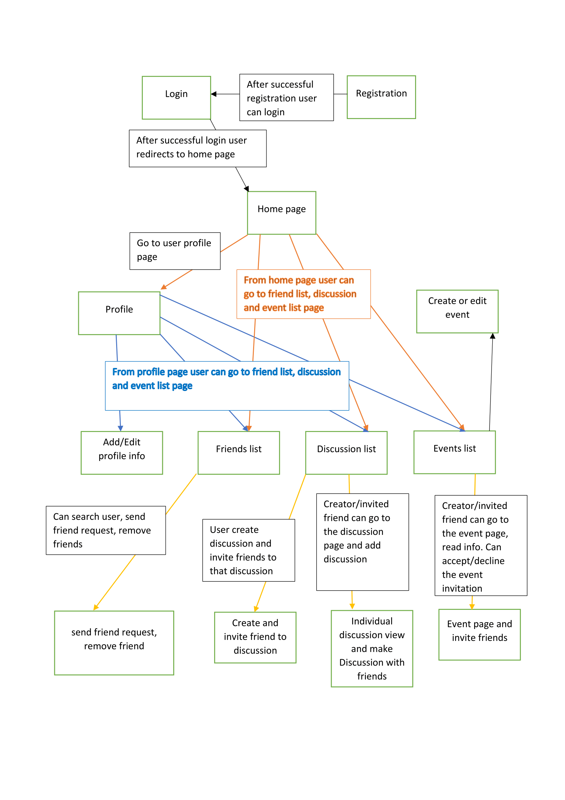

**Welcome to the home of your group's BWA course project code and documentation!**

This file is where your group writes your project plan/project report.

When you write it, you must use Markdown. [Documentation for GitLab Flavored Markdown (GFM)](https://docs.gitlab.com/ee/user/markdown.html).


# Initial project plan document
The headers that must be present in this document are shown here. They were copied here from the course project assignment document.

For instructions on what to add under these headers, see the course project assignment document, [Appendix 2: Initial project plan document](https://docs.google.com/document/d/1iJ4z8dQzUWht0ABX18RXa5Rp8hY76vcMJvBbxODs3PE/edit?usp=sharing#heading=h.m6xhgmo8x8lz)

## Course project group information
Group members:

1. Md Sazzad Ul Islam - 281821 - mdsazzadul.islam@student.tut.fi
2. Mohammad Ariful Islam Mahmud - 281791 - mahmudm@student.tut.fi
3. Lucas Toulier Ancian - 282862 - lucas.toulierancian@student.tut.fi

Group name: Group030

GitLab Repo: https://course-gitlab.tut.fi/bwa-2018/bwa-group030

Heroku deployment url: https://gentle-fjord-99638.herokuapp.com/

Site admin 1:
username: admin1
password: bwa2018django1

Site admin 2:
username: admin2
password: bwa2018django2

Demo User : 
1. ariful3610@yahoo.com         Password : Ar661260
2. sazzad@oployeelabs.com       password: ZAQ!2wsx
3. biswa.jeet@gmail.com         password: ZAQ!2wsx
4. sazzad.rupak17@gmail.com     password: ZAQ!2wsx
5. asif.raihan@gmail.com        password: ZAQ!2wsx

## Must have features
- [x] User
    - [x] Registration with mandatory information
        + real name
        + username
        + valid email address
        + phone number
        + address
        + date of birth
        + gender
        + image (can upload later)
    - [x] Login (Existing user)
    - [x] Logout (Existing user)
    - [x] Email validation on signup
    - [x] Reset forgotten password

- [x] User profile
    - [x] Add edit delete personal information
    - [x] show public data to everyone e.g. username, name
    - [x] show private data only to friends
    - [x] edit and save personal data
    - [x] add status message
    - [x] show latest message (including date and time of post) with chronological ordered comments first
    - [x] show previous message (including date and time of post) with chronological ordered comments

- [x] Friends, friend request information
    - [x] user can see his/her friends list (with link to friends' profile page)
    - [x] send friend request to second user
    - [x] First user can see the friend request given to second user
    - [x] Second user see the first users' friend request with username, name, date and time
    - [x] User can accept or reject the friend request came from other user
    - [x] User can see to whom they gave friend request and requests those came to the user (requests are those which has not been accepted or rejected yet)
    - [x] User can delete an existing friendship

- [x] Discussions
    - [x] User create a discussion (Let's say this user **"admin user"** for this discussion part)
    - [x] User can send text, see other users text under a discussion head (chronological order with date and time)
    - [x] User can edit and delete any text message, and a user can only delete his/her own comments
    - [x] Each Discussion should have a unique url and page
    
- [x] Notification
    - [x] User will get notification after 15 seconds
    - [x] Friend request incoming message, friend request accepted message, friend request withdrawn message, friend request delete message
    - [x] A Friend added a post status notification
    - [x] A friend added comment notification
    - [x] Every new discussion head notification created by friend
    - [x] New incoming text message notification
    
- [x] Search
    - [x] Main search (In the header)
        - [x] User can search by other user name, click user from result list and redirect to user profile page
        - [x] User can search by discussion header which are created by users' friends, can click on a discussion head and redirect it to discussion head view page
    
    - [x] Discussion search (In 'all discussion' view page )
        - [x] User can search by "user name", and the result will be those discussion heads where the "user name" added text
        - [x] User can search by a random "message text", and the result will be those discussion heads where the "message text" are found
    
    - [x] Discussion search (In a 'discussion head' view page )
        - [x] User can search by "user name", and the result will be those discussion heads where the "user name" added text
        - [x] User can search by a random "message text", and the result will be those lines where the "message text" are found

## Planned +2 features
- [x] Using bootstrap for mobile friendliness
- [x] PostgreSQL database
- [x] 3rd party login

## Pages and navigation




## Technological considerations
- [x] Django framework
- [x] Python as programming language
- [x] PostgreSQL database
- [x] HTML for template design
- [x] CSS
- [x] Bootstrap CSS faramework
- [x] JQuery
- [x] Font awesome icons
- [x] Ajax for discussion and feed loading
- [x] Heroku as deployment server


### Django apps in your Django project

- [x] Normaluser App
- [x] Profile App
- [x] Friend App
- [x] Discussion App
- [x] Notification App

### Needed Django models and their attributes

- [x] Normal User Model
- [x] Friend Model
- [x] Discussion Model
- [x] Home Model
- [x] Notification Model

### URIs
Project url:
```python
    urlpatterns = [
        path('login/', views.user_login, name='login'),
        path('logout', views.user_logout, name='logout'),
        path('registration/', views.user_registration, name='registration'),
        path('registration/email_authenticate_registration/<slug:email_validation_code>',
             views.email_authenticate_registration, name='email_authenticate_registration'),
        path('password_reset/', views.user_password_reset, name='password_reset'),
        path('password_recover/<slug:username>', views.password_recover, name='password_recover'),
        path('friends/', include(('friends.urls', 'friends'), namespace='friends')),
        path('', include(('home.urls', 'home'), namespace='home')),
        path('profile/', include(('normaluser.urls', 'normaluser'), namespace='normaluser')),
        path('admin/', admin.site.urls),
    ]
```

Friend app url:

```python
    urlpatterns = [
        path('', views.friend_list, name='friend_list'),
        path('create_friendship', views.create_friendship, name='create_friendship'),
        path('delete_friendship_request', views.delete_friendship_request, name='delete_friendship_request'),
        path('accept_friendship_request', views.accept_friendship_request, name='accept_friendship_request')
    ]
```

Home app url:

```python
    urlpatterns = [
        path('', views.index, name='home'),
        path('comment_add/', views.comment_add, name='comment_add'),
        path('more_status_after_mouse_scroll/<slug:last_item_id>', views.more_status_after_mouse_scroll,
             name='more_status_after_mouse_scroll'),
        path('status_details/<slug:post_id>', views.status_details,
             name='status'),
        path('edit_post/<slug:post_id>', views.edit_post, name='edit_post'),
        path('delete_post/<slug:post_id>', views.delete_post, name='delete_post'),
        path('get_comment/<slug:comment_id>', views.get_comment, name='get_comment'),
        path('delete_comment/<slug:comment_id>/<slug:post_id>', views.delete_comment, name='delete_comment'),
        path('cancel_comment_edit/<slug:comment_id>/<slug:post_id>', views.cancel_comment_edit, name='cancel_comment_edit'),
        path('comment_update', views.comment_update, name="comment_update")
    ]
    urlpatterns += staticfiles_urlpatterns()
    urlpatterns += static(settings.MEDIA_URL, document_root=settings.MEDIA_ROOT)
```

Normal User url:

```python
    urlpatterns = [
        path('', views.profile, name='profile'),
        path(r'edit/', views.edit_profile, name='edit_profile'),
        path('update_profile', views.update_profile, name='update_profile'),
        path('upload_profile_image', views.upload_profile_image, name='upload_profile_image'),
        path('delete_account', views.delete_account, name='delete_account'),
        # path('other/<slug:username1>.+', views.user_profile, name='other'),
        re_path(r'^other/(?P<username1>.*)/$', views.user_profile, name='other'),
        re_path(r'^user_search/$', views.user_search, name='user_search'),
    ]
    urlpatterns += staticfiles_urlpatterns()
    urlpatterns += static(settings.MEDIA_URL, document_root=settings.MEDIA_ROOT)
```

Discussion url:

```python
    urlpatterns = [
        path('', views.index, name='discussion'),
        path('create_new_discussion', views.create_new_discussion, name='create_new_discussion'),
        path('all_discussions', views.all_discussions, name='see_all_discussion'),
        path('get_discussion_head_texts/<slug:discussion_head_id>', views.get_discussion_head_texts,
             name='get_discussion_head_texts'),
        path('save_chat', views.save_chat, name='save_chat'),
        path('discussion_head_view_update', views.discussion_head_view_update, name='discussion_head_view_update'),
        path('add_chat_after_view/<slug:discussion_head_id>', views.add_chat_after_view, name='add_chat_after_view'),
        path('discussion_head_lists_update/<slug:discussion_head_id>', views.discussion_head_lists_update, name='discussion_head_lists_update'),
        path('message/<slug:discussion_head_id>', views.message, name='message'),
        path('all_discussion_search_result', views.all_discussion_search_result, name='all_discussion_search_result'),
        path('single_discussion_search_result', views.single_discussion_search_result, name='single_discussion_search_result'),
        path('get_discussion_info', views.get_discussion_info, name='get_discussion_info'),
        path('get_message/<slug:chat_id>', views.get_message, name='get_message'),
        path('chat_update', views.chat_update, name='chat_update'),
        path('cancel_message_edit/<slug:chat_id>/<slug:head_id>', views.cancel_message_edit, name='cancel_message_edit'),
        path('delete_chat/<slug:chat_id>', views.delete_chat, name="delete_chat")
    ]
    urlpatterns += staticfiles_urlpatterns()
    urlpatterns += static(settings.MEDIA_URL, document_root=settings.MEDIA_ROOT)
```

Notification url:

```python
    urlpatterns = [
        path('', views.index, name='notification'),
        path('ajax/notification_status_change', views.notification_status_change, name='notification_status_change'),
        path('get_all_notification_info', views.get_all_notification_info, name='get_all_notification_info')
    ]
    urlpatterns += staticfiles_urlpatterns()
```

## Problems we have faced

+ uploaded image file goes missing/deleted from heroku after a while. Reason is here (https://help.heroku.com/K1PPS2WM/why-are-my-file-uploads-missing-deleted)


### Needed Django views and templates


### Heroku deployment
Our project already deployed here:

https://gentle-fjord-99638.herokuapp.com/


## Testing
We tested our application with keeping white box and black box testing methodologies in mind. As we developing this application we testing our application manually and some automated tests as well.
Issues that discovered form the testing were solved immediately and got 2 feedback from Sami Aalto after mid project check in. Those issues were solved immediately as well.  

## Project timetable and division of work

| Order | Feature/Design | Estimated Time | Ariful | Lucas | Sazzad | 
| :---: | :------: | :------------: | :-----------: | :------: | :------------: |
| 1     | Project planning   | 22-10-18 to 28-10-18 | :white_circle: | :white_circle: | :white_circle: |
| 2     | Initial template deisgn with styling   | 04-10-18 to 09-11-18 | :white_circle: | :white_circle: |  |
| 3     | Heroku deployment | 01-11-18 | | | :white_circle: |
| 4     | Database design | 04-11-18 to 08-11-18 | :white_circle: | :white_circle: | :white_circle: |
| 5     | User registration, login, logout, reset password, email validation | 04-11-18 to 09-11-18 |  |  | :white_circle: |
| 6     | User profile module | 10-11-18 to 16-11-18| :white_circle: | :white_circle: |  |
| 7     | Friends module | 10-11-18 to 16-11-18| :white_circle: |  |  |
| 8     | Events module | 17-11-18 to 23-11-18| | :white_circle: | :white_circle: |
| 9     | Discussions module | 17-11-18 to 23-11-18| :white_circle: |  | :white_circle: |
| 10    | Project testing | 24-11-18 to 26-11-18| :white_circle: | :white_circle: | :white_circle: |
| 11    | Mobile friendliness | 05-11-18 to 26-11-18| :white_circle: | :white_circle: | :white_circle: |


# Heroku Django Starter Template

An utterly fantastic project starter template for Django 2.0.

## Features

- Production-ready configuration for Static Files, Database Settings, Gunicorn, etc.
- Enhancements to Django's static file serving functionality via WhiteNoise.
- Latest Python 3.6 runtime environment.

## How to Use

To use this project, follow these steps:

1. Create your working environment.
2. Install Django (`$ pipenv install django`)
3. Create a new project using this template

## Creating Your Project

Using this template to create a new Django app is easy::

    $ django-admin.py startproject --template=https://github.com/heroku/heroku-django-template/archive/master.zip --name=Procfile helloworld

(If this doesn't work on windows, replace `django-admin.py` with `django-admin`)

You can replace ``helloworld`` with your desired project name.

## Deployment to Heroku

    $ git init
    $ git add -A
    $ git commit -m "Initial commit"

    $ heroku create
    $ git push heroku master

    $ heroku run python manage.py migrate

See also, a [ready-made application](https://github.com/heroku/python-getting-started), ready to deploy.


## License: MIT

## Further Reading

- [Gunicorn](https://warehouse.python.org/project/gunicorn/)
- [WhiteNoise](https://warehouse.python.org/project/whitenoise/)
- [dj-database-url](https://warehouse.python.org/project/dj-database-url/)
